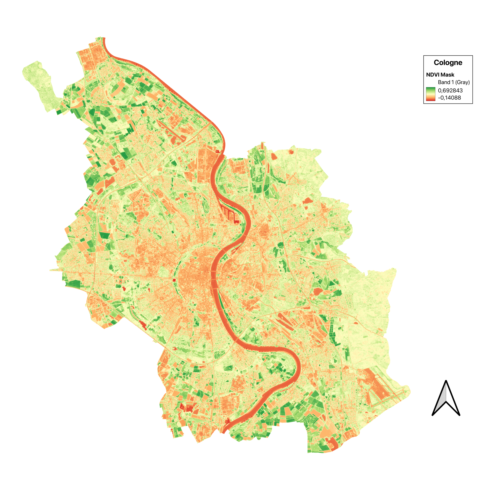
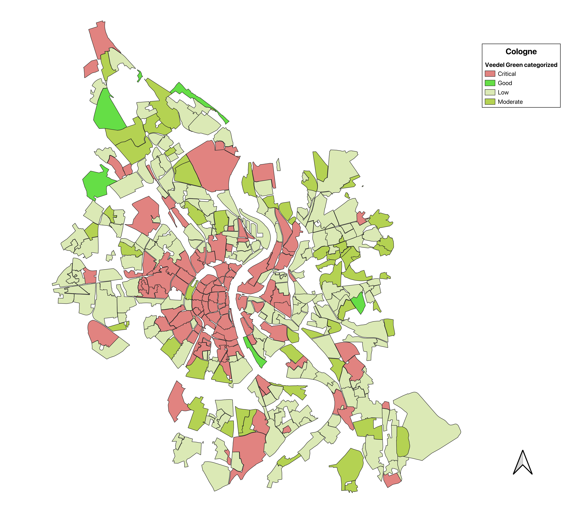

# Cologne Green Project

This project analyzes green areas in Cologne using satellite imagery and GIS data. It includes NDVI calculation, vector and raster reprojection, and visualization of results with legends and colormaps.

## Example Visualizations

### NDVI for Cologne

*Original high-resolution NDVI image is available as `ndvi_10m.png` (large file, may not display on GitHub).* 

### Categorized Green Analysis by Veedel

## Project Structure
- `data/` — Contains input boundaries, satellite images, and outputs
- `Notebooks/` — Additional notebooks for saving layers and processing

## Main Steps
1. **Import and reproject raster/vector data** to a common CRS (EPSG:25832)
2. **Calculate NDVI** and other green indices
3. **Clip rasters** to the Cologne city boundary
4. **Visualize and export** styled layers as images with legends

## How to Use
- Open the notebooks in QGIS or a QGIS-enabled Jupyter environment
- Follow the step-by-step cells to process and visualize the data
- Export results to `data/outputs/`

## Requirements
- QGIS with Python (PyQGIS)
- Satellite and boundary data for Cologne

## Credits
- Open data from Stadt Köln and Copernicus/Sentinel

---
For more details, see the notebooks and data folders.