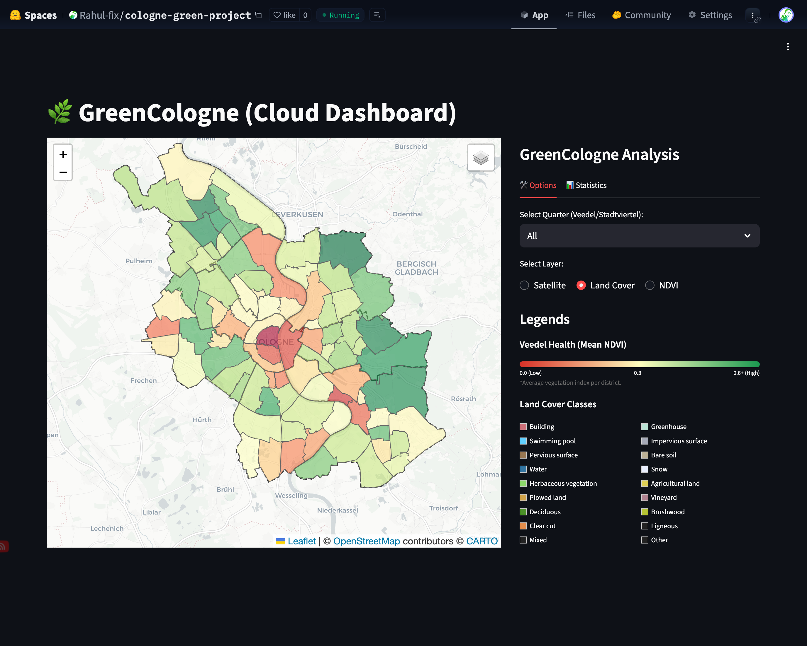
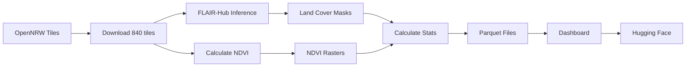

# 🌿 GreenCologne – Urban Vegetation Analysis Dashboard

[](https://huggingface.co/spaces/Rahul-fix/cologne-green-project)
[](https://www.python.org/downloads/)
[](https://streamlit.io/)
[](https://opensource.org/licenses/MIT)

An interactive geospatial dashboard ([link](https://huggingface.co/spaces/Rahul-fix/cologne-green-project)) analyzing green spaces across Cologne's 86 neighborhoods ("Veedel"). Powered by **deep learning land cover segmentation**, **satellite imagery from OpenNRW**, and **NDVI vegetation indexing**.

<p align="center">
  
</p>

---

## ✨ Features

### 🗺️ Interactive Map Visualization
- **NDVI Choropleth**: Color-coded neighborhoods by vegetation health (Red → Yellow → Green)
- **Land Cover Overlay**: 19-class semantic segmentation (buildings, water, vegetation, etc.)
- **Satellite Imagery**: High-resolution aerial photos from OpenNRW (10cm resolution)
- **Click-to-Select**: Interactive neighborhood exploration
- **Statistics**: Green area metrics, land cover distribution, NDVI analysis

### 📊 Comprehensive Statistics
- **Green Area Metrics**: Hectares of vegetation per neighborhood
- **Land Cover Distribution**: Breakdown by class (deciduous, herbaceous, agricultural, etc.)
- **NDVI Analysis**: Normalized Difference Vegetation Index per district

### 🚀 Dual Deployment
- **Local Mode**: Fast preview using local files
- **Cloud Mode**: Fully hosted on Hugging Face Spaces with Docker

---

## 🛠️ Technology Stack

| Category | Technologies |
|----------|-------------|
| **Frontend** | Streamlit, Folium, Plotly |
| **Geospatial** | GeoPandas, Shapely, Rasterio |
| **Data** | DuckDB, Parquet, GeoTIFF |
| **ML/AI** | FLAIR-Hub (semantic segmentation), Transformers |
| **Cloud** | Hugging Face Hub, Docker |
| **Source Data** | OpenNRW (satellite), Offene Daten Köln (boundaries) |

---

## 🚀 Quick Start

### Prerequisites
- Python 3.11+ 
- [uv](https://github.com/astral-sh/uv) package manager (recommended)
- Hugging Face token (for cloud features)

### Installation

```bash
# Fork and clone the repository
git clone https://github.com/YOUR_USERNAME/cologne-green-project.git
cd cologne-green-project

# Install dependencies
uv sync

# Run local dashboard
uv run streamlit run streamlit_app/app_local.py
```

### Cloud Version

```bash
# Set your HF token
echo "HF_TOKEN=hf_your_token_here" > DL_cologne_green/.env

# Run cloud-connected dashboard
uv run streamlit run streamlit_app/app_hf.py
```

---

## 📁 Project Structure

```
cologne-green-project/
├── streamlit_app/
│   ├── app_local.py       # Local file-based dashboard
│   ├── app_hf.py          # Cloud-connected dashboard
│   └── utils.py           # Shared utilities & mosaic logic
├── scripts/
│   ├── 01-05_*.py         # Data download & processing
│   ├── 06_calculate_full_stats.py    # Veedel statistics
│   ├── 08_create_web_optimized*.py   # Tile optimization
│   └── sync_to_hf.py      # Upload to Hugging Face
├── hf_space/              # Ready-to-deploy HF Space
│   ├── Dockerfile
│   ├── app.py
│   └── requirements.txt
├── data/
│   ├── boundaries/        # Cologne shapefiles (Parquet)
│   ├── processed/         # Segmentation masks & NDVI
│   ├── stats/             # Aggregated statistics
│   └── web_optimized/     # Optimized map tiles
└── docs/guides/           # Documentation
```

---

## 🎨 Land Cover Classes

The dashboard visualizes 19 land cover classes from the FLAIR-Hub segmentation model:

| Class | Color | Description |
|-------|-------|-------------|
| 🏠 Building | `#ce7079` | Residential/commercial structures |
| 🌳 Deciduous | `#4c9129` | Deciduous trees and forests |
| 🌿 Herbaceous | `#8cd76a` | Grass, parks, meadows |
| 💧 Water | `#3375a1` | Rivers, lakes, pools |
| 🛣️ Impervious | `#a6aab7` | Roads, parking lots |
| 🌾 Agricultural | `#decf55` | Farmland, crops |
| ... | ... | *+ 13 more classes* |

---

## 📈 Data Pipeline



### Key Scripts

| Script | Purpose |
|--------|---------|
| `06_calculate_full_stats.py` | Compute green area & NDVI per Veedel |
| `08_create_web_optimized_tiles.py` | Create fast-loading map tiles |
| `sync_to_hf.py` | Upload processed data to Hugging Face |

---

## 🐳 Docker Deployment

```bash
cd hf_space

# Build
docker build -t greencologne .

# Run
docker run -p 7860:7860 -e HF_TOKEN="hf_xxx" greencologne

# Open http://localhost:7860
```

---

## 📊 Data Sources

- **Satellite Imagery**: [OpenNRW DOP10](https://www.opengeodata.nrw.de/produkte/geobasis/lusat/akt/dop/dop_jp2_f10/) – 10cm resolution aerial photos
- **Administrative Boundaries**: [Offene Daten Köln](https://www.offenedaten-koeln.de/) – Stadtviertel & Stadtbezirke
- **Land Cover Model**: [FLAIR-Hub](https://huggingface.co/IGNF/FLAIR-HUB) – Semantic segmentation trained on French aerial imagery

---

## 🤝 Contributing

Contributions are welcome! Please feel free to submit a Pull Request.

1. Fork the repository
2. Create your feature branch (`git checkout -b feature/AmazingFeature`)
3. Commit your changes (`git commit -m 'Add AmazingFeature'`)
4. Push to the branch (`git push origin feature/AmazingFeature`)
5. Open a Pull Request

---

## 📄 License

This project is licensed under the MIT License - see the [LICENSE](LICENSE) file for details.

---

## 🙏 Acknowledgments

- **[CorrelAid](https://correlaid.org/)** – Data-for-good community enabling this project
- **[OpenNRW](https://www.opengeodata.nrw.de/)** – Open geospatial data for North Rhine-Westphalia
- **[IGNF/FLAIR-Hub](https://huggingface.co/IGNF/FLAIR-HUB)** – State-of-the-art land cover segmentation
- **[Stadt Köln](https://www.stadt-koeln.de/)** – Open administrative data

---

<p align="center">
  Made with 💚 for urban green space analysis
</p>
